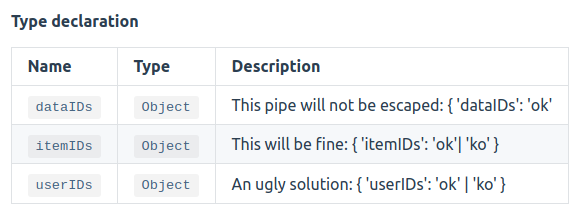
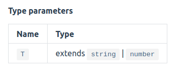

# Repro code for typedoc-plugin-markdown#286

The issue is about escaping the `|` char.
Escaping works fine in arguments description, but not in type descriptions.


## Generate documentation
To generate the documentation, use:
```
npm run doc-markdown
```

## Using VuePress for a nice render
```
npm run vuepress
```

Once vuepress has finish building, doc can be accessed here:
- Module: `http://localhost:8080/modules.html`
- Interface: `http://localhost:8080/interfaces/demoInterface.html`


## Result

### Type description
The description of `dataIDs` is not fully rendered.




### Argument description
Everything is fine here.


